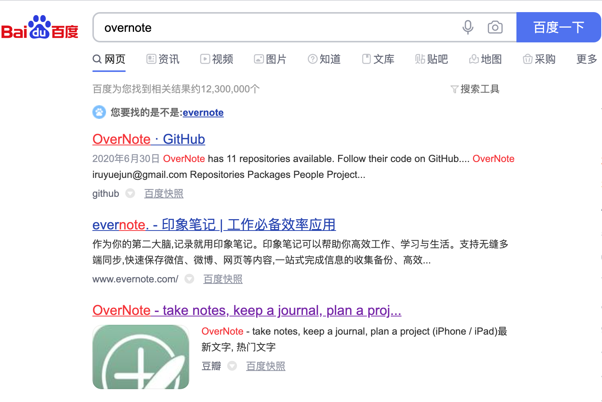
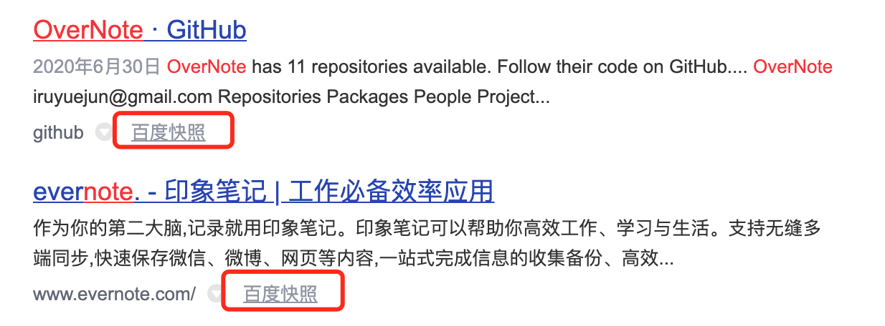

# 04-前后分离 -1-SEO

## 一 搜索引擎优化概念

搜索引擎优化（SEO）这个话题并不在前端开发的讨论范围之内，他也不属于性能优化的范畴。但是很多场景中，前端都与 SEO 有着联系。

我们知道，我们获取一些信息往往并不是直接通过在浏览器中输入网址而直接得到的，大多场景中，我们都是打开百度、谷歌这样的搜索网站，输入想要搜索的关键字来进行查询的。其查询结果如下所示：



包含搜索关键字的网页就会在百度中一一`排列`出来。这个关键词可以是网页中的标题、说明、文本内容等各个区域。

很显然，网址的排名越靠前，就能获得越大的曝光度，对营销是有极大的帮助的。

这些最终的排序结果都来自于搜索引擎内部的算法得出，搜索引擎优化其实就是针对现在已知道的算法细节进行处理，让我们的网页能够更好的靠前展示。

现在常规的搜索引擎优化方法有：为网页设置合理的标题、说明，网页内容符合用户要求且更加原创化等等。

## 二 收录与排名

### 2.1 收录

一个新建的网站，即使内容再优秀，再原创，不到一定的时间，在搜索引擎内也是无法被搜索到的，同理，一些具体的文章页面也会有这样的规律，比如新浪博客内的文章发布后不会立刻在百度中被搜索到，而是需要等待一段时间，这个等待时间肯恩是几小时，几天，几个月甚至永久无法等到。

这种网址被百度记录下来的现象，我们称之为**收录**。

### 2.2 简单理解搜索引擎

很多没有技术背景的产品、SEO 人员可能不会注意到，百度等搜索引擎与我们自己的内容网址，如新浪微博、人民网等是毫无关联的，我们在搜索内容的时候，搜索的关键字也是与具体收录的网址是无关的。我们的一切操作都是在百度这样的网站内部做的，百度等搜索引擎只是一个面向用户的网站，与我们登陆微博、使用微信没有本质区别。

但是百度内部维护了一份数据库，这个数据库将天下数以万亿记的网页全部都以快照的形式存储了下来，当我们搜索关键字的时候，百度会自己检索内部的这个数据库，找到与你搜索内容匹配度较高的网址列表，然后按照顺序一一展示出来。

> 快照：类似拍照一样，百度并不是存储了网站，而是对一个网址进行内的内容进行当前时间点的保存。

在百度的搜索结果列表中展示的，其实是某个时间点的快照内容，而不是当前网页内容，只有通过点击链接进入才能实时查看，当然百度、谷歌这样的公司也提供了查看快照的功能：



### 2.3 蜘蛛

现在有了新的问题：百度是如何知道世界上这么多网站的？

百度会对一些网站发送一些请求，得到这些网页内容后，会逐步查找网页内的一些 a 连接标签，并沿着这些链接逐个进入，从而能够不断的进入的世界上各个网站的各个角落，这种行为很类似蜘蛛，或者称呼为爬虫。

每隔一段时间，你的网站就会被各大搜索引擎的蜘蛛光临一次，蜘蛛爬取到的内容越多，也就说明你的网站的越多的内容会被收录，由于蜘蛛的本质其实是数据请求，在后台是可以完全根据请求头监控到的。

常见的蜘蛛有：

- 百度：Baiduspider（抓取网页）、Baiduspider-mobile（抓取 wap）、Baiduspider-image（抓取图片）、Baiduspider-video（抓取视频）、Baiduspider-news（抓取新闻）。
- 谷歌：Googlebot
- 360：360Spider
- 必应：bingbot
- 一淘网蜘蛛：EtaoSpider

### 2.4 robots 协议

由于蜘蛛会通过链接无限制抓取内容，这样就会产生一定的安全隐患，如：一些隐私的页面，客户信息等数据页面不想被蜘蛛抓取收录，该如何处理？

合法的蜘蛛一般都会遵循 **robots 协议**。即在网站的根目录下放置一个 ASCII 编码的 txt 文件：`robots.txt`，蜘蛛在开始爬取网站时，会先进入该文件，读取权限信息。

`robots.txt` 内可以设定蜘蛛不允许爬哪些内容，允许爬哪些内容：

```txt
User-agent: * 这里的*代表的所有的搜索引擎种类，*是一个通配符
Disallow: /admin/ 这里定义是禁止爬寻 admin 目录下面的目录
Disallow: /require/ 这里定义是禁止爬寻 require 目录下面的目录
Disallow: /ABC/ 这里定义是禁止爬寻 ABC 目录下面的目录
Disallow: /cgi-bin/*.htm 禁止访问/cgi-bin/目录下的所有以".htm"为后缀的URL(包含子目录)。
Disallow: /*?* 禁止访问网站中所有包含问号 (?) 的网址
Disallow: /.jpg$ 禁止抓取网页所有的.jpg 格式的图片
Disallow:/ab/adc.html 禁止爬取 ab 文件夹下面的 adc.html 文件。
Allow: /cgi-bin/　这里定义是允许爬寻cgi-bin目录下面的目录
Allow: /tmp 这里定义是允许爬寻 tmp 的整个目录
Allow: .htm$ 仅允许访问以".htm"为后缀的 URL。
Allow: .gif$ 允许抓取网页和 gif 格式图片
```

## 三 前端在 SEO 中的一些处理

### 3.1 标题标签权重高

标题标签对搜索引擎的抓取有着重要作用，因为标题往往代表了网页的内容，其中 `h1` 标签提升的权重最高，这里推荐在一个 HTML 文档中，尽量只保留一个`h1` 标签，以免引起误会。

### 3.2 标签语义化

通过 div 与 css 能够实现合理布局，但是如果能够使用语义化的标签，则更符合蜘蛛的口味：

```html
<!- main 标签推荐出现一次 -->
<main>
  <article>文本 1</article>
  <article>
    <section>段落 1</section>
    <section>段落 2</section>
  </article>
  <aside>附近内容</aside>
</main>
```
